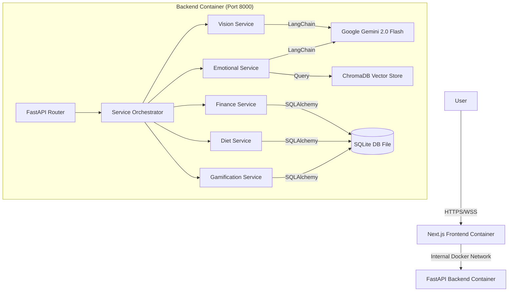

# 🚀 Flagship: The "God Level" AI Lifestyle Advisor

> **"A digital extension of your consciousness, optimizing Health, Wealth, and Mind."**

Welcome to the **definitive technical reference** for Flagship. This document is designed for developers, architects, and users who want to understand every single nut and bolt of the system.

## 📖 Documentation

| Document | Purpose |
|----------|---------|
| **[PROJECT.md](PROJECT.md)** | Quick project overview with all features |
| **[README.md](README.md)** | Technical deep-dive (this file) |
| **[DEPLOY_ONLINE.md](DEPLOY_ONLINE.md)** | VPS deployment guide |
| **[QUICKSTART.md](QUICKSTART.md)** | Getting started in 5 minutes |
| **[RAG_IMPLEMENTATION.md](RAG_IMPLEMENTATION.md)** | AI/RAG architecture |
| **[DATA_SOURCES.md](DATA_SOURCES.md)** | Database and data sources |

---

## 📚 Table of Contents
1.  [System Architecture](#-system-architecture)
2.  [Technology Stack (Detailed)](#-technology-stack-detailed)
3.  [Core Modules & Algorithms](#-core-modules--algorithms)
    *   [3.1 Command Center (Dashboard)](#31-command-center-dashboard)
    *   [3.2 Smart Diet (Vision Nutritionist)](#32-smart-diet-vision-nutritionist)
    *   [3.3 Wealth Manager (Budget Planner)](#33-wealth-manager-budget-planner)
    *   [3.4 Emotional Support (AI Therapist)](#34-emotional-support-ai-therapist)
4.  [AI & Prompt Engineering](#-ai--prompt-engineering)
5.  [API Reference (Endpoints)](#-api-reference-endpoints)
6.  [Database Schema (SQLite)](#-database-schema-sqlite)
7.  [Gamification Logic](#-gamification-logic)
8.  [Deployment & DevOps](#-deployment--devops)
9.  [Troubleshooting](#-troubleshooting)

---

## 🏗️ System Architecture

Flagship uses a **Containerized Microservices Architecture**.



---

## 💻 Technology Stack (Detailed)

### **Frontend**
*   **Next.js 15 (App Router)**: Uses Server Components for performance and Client Components for interactivity.
*   **React 19**: Leverages the latest hooks and concurrency features.
*   **TailwindCSS 4**: Zero-runtime CSS-in-JS styling engine.
*   **Framer Motion**: Physics-based animation library.
    *   *Configuration*: `damping: 20`, `stiffness: 300` for "Apple-like" fluid motion.
*   **Lucide React**: Vector icon library.

### **Backend**
*   **FastAPI**: High-performance Python web framework (ASGI).
*   **Uvicorn**: Lightning-fast ASGI server implementation.
*   **LangChain**: Framework for LLM orchestration and chaining.
*   **SQLite**: Serverless, self-contained SQL database engine.
*   **ChromaDB**: AI-native open-source embedding database for RAG.

---

## 🧠 Core Modules & Algorithms

### 3.1 Command Center (Dashboard)
**Purpose**: Aggregation and "God's Eye View".
*   **Logic**:
    1.  **Data Fetching**: Parallel fetch of `user_stats`, `recent_transactions`, and `todays_meals`.
    2.  **Insight Generation**: The raw data is fed into a prompt template:
        > "User has Level {level}, spent ${spent} today, and ate {calories} kcal. Summarize their day in one sentence."
    3.  **Rendering**: Displays a "Gamification Badge" with a progress bar calculated as:
        `Progress % = ((Current XP - Level Start XP) / (Next Level XP - Level Start XP)) * 100`

### 3.2 Smart Diet (Vision Nutritionist)
**Purpose**: Frictionless calorie tracking via Computer Vision.
*   **Algorithm**:
    1.  **Image Preprocessing**: Image is resized and converted to Base64.
    2.  **Multimodal Prompting**:
        > "Analyze this image. Identify food items. Estimate portion size. Return JSON: {calories, protein, carbs, fat}."
    3.  **JSON Parsing**: The LLM's text response is stripped of markdown and parsed into a Python dictionary.
    4.  **Persistence**: Data is inserted into the `meals` table.

### 3.3 Wealth Manager (Budget Planner)
**Purpose**: Financial forecasting and status grading.
*   **Status Algorithm**:
    ```python
    savings = income - expenses
    savings_rate = (savings / income) * 100
    
    if savings_rate >= 20: return "Excellent" (Emerald)
    elif savings_rate >= 10: return "Good" (Blue)
    elif savings_rate > 0:   return "Fair" (Yellow)
    else:                    return "Needs Improvement" (Red)
    ```
*   **Forecasting Algorithm (Linear Projection)**:
    *   Assumption: Savings remain constant per month.
    *   `Month[n] = Current_Savings + (Monthly_Savings * n)`
    *   This generates a 6-month array used to render the Bar Chart.

### 3.4 Emotional Support (AI Therapist)
**Purpose**: Context-aware mental health support.
*   **RAG Pipeline**:
    1.  **Embedding**: User query is converted to a vector embedding.
    2.  **Retrieval**: ChromaDB finds the 3 most similar "Scripture Chunks" (e.g., verses from the Gita).
    3.  **Augmentation**: The retrieved verses are injected into the system prompt.
    4.  **Generation**: Gemini generates a response that synthesizes the user's problem with the scriptural wisdom.

---

## 🤖 AI & Prompt Engineering

We use **Google Gemini 2.0 Flash** for its speed and multimodal capabilities.

### **Vision Prompt (Food)**
```text
"Analyze this food image. Return a JSON object with: 
'food_name' (string), 
'calories' (integer estimate), 
'protein' (integer estimate), 
'carbs' (integer estimate), 
'fat' (integer estimate), 
'health_score' (1-10 integer). 
Be concise."
```

### **Vision Prompt (Receipts)**
```text
"Analyze this receipt. Return a JSON object with: 
'merchant' (string), 
'total_amount' (float), 
'date' (string YYYY-MM-DD), 
'category' (string e.g., Food, Transport). 
If unclear, estimate."
```

---

## 🔌 API Reference (Endpoints)

### **Finance**
*   `GET /finance/budget`
    *   **Query Params**: `income` (float), `expenses` (float)
    *   **Response**:
        ```json
        {
          "savings": 20000,
          "savings_rate": 40.0,
          "status": "Excellent",
          "recommendation": "Invest in mutual funds...",
          "forecast": [{"month": "Month 1", "savings": 20000}, ...]
        }
        ```

### **Vision**
*   `POST /vision/analyze-food`
    *   **Body**: `file` (UploadFile)
    *   **Response**: JSON with nutritional info.

### **Gamification**
*   `GET /gamification/stats`
    *   **Response**:
        ```json
        {
          "level": 5,
          "xp": 1250,
          "title": "Pro",
          "next_level_xp": 1500,
          "progress": 50.0
        }
        ```

---

## 🗄️ Database Schema (SQLite)

The database is located at `backend/data/flagship.db`.

### **Table: `users`**
| Column | Type | Description |
| :--- | :--- | :--- |
| `id` | INTEGER PK | Unique User ID |
| `name` | TEXT | Display Name |

### **Table: `transactions`**
| Column | Type | Description |
| :--- | :--- | :--- |
| `id` | INTEGER PK | Auto-increment ID |
| `amount` | REAL | Transaction value |
| `type` | TEXT | 'income' or 'expense' |
| `category` | TEXT | e.g., 'Food', 'Rent' |
| `date` | TEXT | ISO 8601 Date String |

### **Table: `user_stats`**
| Column | Type | Description |
| :--- | :--- | :--- |
| `id` | INTEGER PK | Linked to User |
| `xp` | INTEGER | Total Experience Points |
| `level` | INTEGER | Current Level (1-99) |
| `streak` | INTEGER | Consecutive days active |

---

## 🎮 Gamification Logic

The leveling curve is **non-linear** (it gets harder to level up).

| Level | XP Required | Title |
| :--- | :--- | :--- |
| 1 | 0 | Novice |
| 2 | 100 | Apprentice |
| 3 | 300 | Seeker |
| 4 | 600 | Achiever |
| 5 | 1000 | Pro |
| ... | ... | ... |
| 10 | 5000 | God Level |

---

## 🚀 Deployment & DevOps

### **Docker Configuration**
*   **Backend**: Uses `python:3.11-slim`. Installs `gcc` for compiling C-extensions (needed for some AI libs).
*   **Frontend**: Uses `node:20-alpine`. Multi-stage build to optimize image size.
*   **Volumes**:
    *   `./backend/data:/app/data`: **CRITICAL**. This maps the container's data folder to your host machine. This ensures that even if you delete the container, your SQLite database (and thus your user data) survives.

### **Environment Variables**
*   `GEMINI_API_KEY`: Required for all AI features.
*   `DATABASE_URL`: Connection string for SQLite (`sqlite:///./data/flagship.db`).
*   `NEXT_PUBLIC_API_URL`: URL for the frontend to reach the backend.

---

## 🔧 Troubleshooting

### **1. "Connection Refused" on Frontend**
*   **Cause**: Backend container isn't running or port 8000 is blocked.
*   **Fix**: Run `docker ps` to check status. Check `docker logs flagship-backend-1`.

### **2. "LLM not initialized"**
*   **Cause**: `GEMINI_API_KEY` is missing in `.env`.
*   **Fix**: Add the key and restart containers (`docker-compose restart`).

### **3. Data Disappears on Restart**
*   **Cause**: Docker volume mapping is incorrect.
*   **Fix**: Ensure `docker-compose.yml` has `- ./backend/data:/app/data`.

---

> **Flagship Technical Manual v1.0**
> *Generated by Antigravity*
