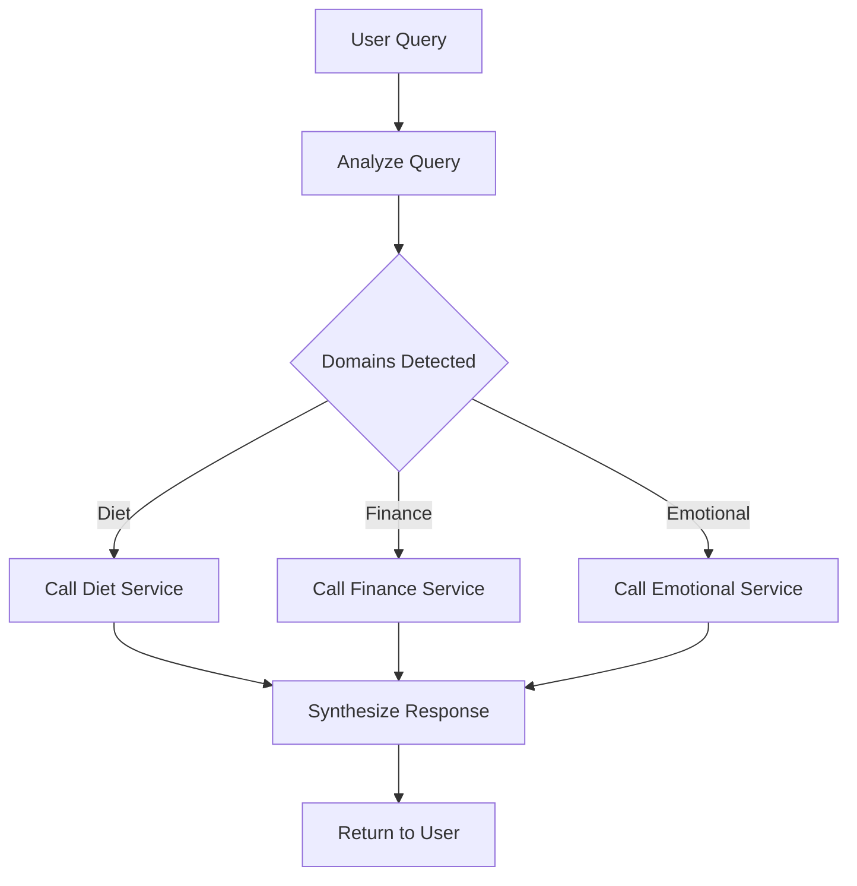

# LangGraph Architecture

## Overview
The orchestrator uses **LangGraph** to create a stateful, cyclical workflow that routes user queries to the appropriate domain agents (Diet, Finance, Emotional).

## State Machine Flow



## Key Components

### 1. State Schema
```python
class AgentState(TypedDict):
    messages: list
    query: str
    detected_domains: list[str]
    diet_response: dict | None
    finance_response: dict | None
    emotional_response: dict | None
    final_response: str
```

### 2. Node Functions
- **analyze_query**: Detects which domains are involved
- **call_diet_service**: Calls diet API if needed
- **call_finance_service**: Calls finance API if needed
- **call_emotional_service**: Calls emotional API if needed
- **synthesize_response**: Combines all responses

### 3. Graph Execution
The graph executes sequentially through all nodes, enabling:
- Multi-domain reasoning
- Conditional routing
- Cyclic workflows (future enhancement)
- State persistence

## MLOps Integration

### Tracking with MLflow
- **Experiments**: Each domain (diet, finance, emotional) has its own experiment
- **Runs**: Each prediction is logged as a run
- **Metrics**: User feedback, accuracy, satisfaction scores
- **Parameters**: Model inputs (calories, budget, mood)

### Usage Example
```python
from mlops.mlflow_config import log_diet_prediction

# Log a diet prediction
log_diet_prediction(calories_predicted=1800, user_feedback="positive")
```

### View Metrics
```bash
mlflow ui
# Access at http://localhost:5000
```
